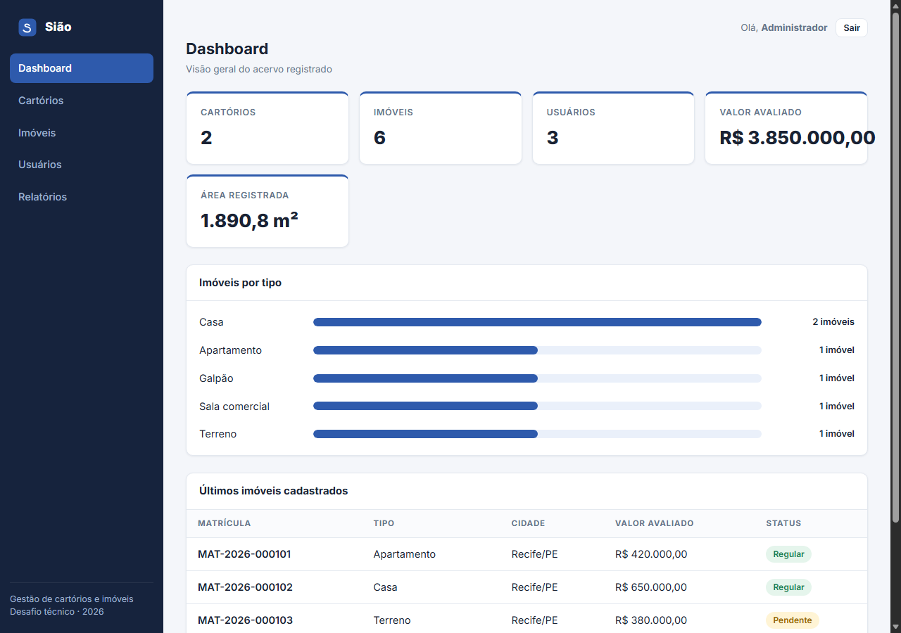
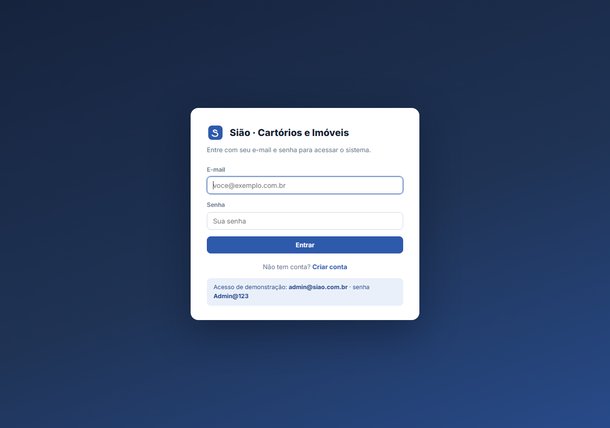
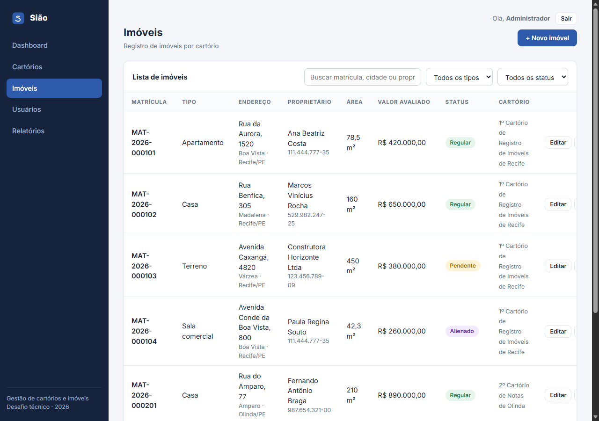
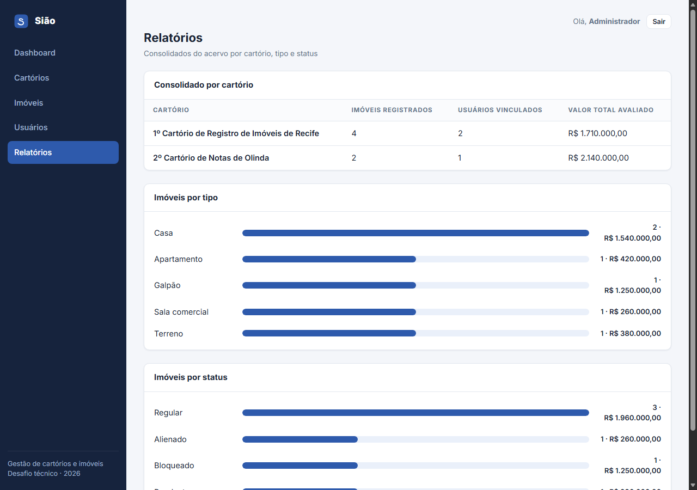
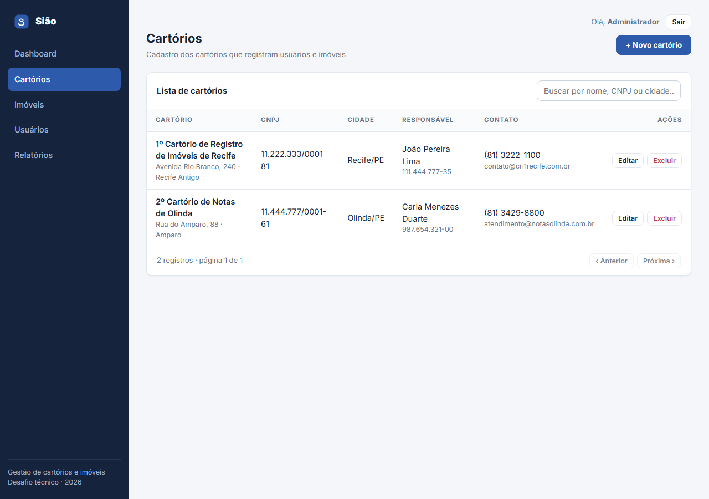

# Desafio Sião — Gestão de Cartórios e Imóveis

Sistema completo (API + frontend) desenvolvido para o desafio técnico de
Desenvolvedor da Sião, com base no modelo ER fornecido (CARTORIO, USUARIO e
IMOVEL).

| Camada | Stack |
|---|---|
| **API** | NestJS 11 · TypeScript · TypeORM · PostgreSQL · JWT (Passport) · Swagger |
| **Frontend** | React 18 · TypeScript · Vite · React Router · Axios |
| **Infra** | Docker + Docker Compose (PostgreSQL + API + nginx) |



---

## 1. Como executar

### Opção A — Docker (recomendada: um comando)

Pré-requisito: Docker com Compose.

```bash
docker compose up --build -d
```

Depois de os containers subirem (as migrations rodam automaticamente):

```bash
# popular o banco com dados de demonstração (opcional, mas recomendado)
docker compose exec api node dist/database/seeds/seed.js
```

| Serviço | URL |
|---|---|
| Frontend | http://localhost:8080 |
| API | http://localhost:3000/api |
| Documentação (Swagger) | http://localhost:3000/api/docs |

### Opção B — Execução local (Node + PostgreSQL)

Pré-requisitos: Node.js 20+ e PostgreSQL 14+ rodando localmente.

**1. Banco de dados** — crie o banco:

```sql
CREATE DATABASE desafio_siao;
```

**2. Backend:**

```bash
cd backend
cp .env.example .env        # ajuste usuário/senha do seu PostgreSQL se necessário
npm install
npm run seed                # roda as migrations e popula os dados de demonstração
npm run start:dev           # API em http://localhost:3000/api
```

**3. Frontend** (em outro terminal):

```bash
cd frontend
npm install
npm run dev                 # app em http://localhost:5173
```

> Em desenvolvimento o Vite faz proxy de `/api` para `http://localhost:3000`
> automaticamente — não há configuração extra de CORS.
> No Windows, o atalho `iniciar-dev.bat` abre os dois servidores de uma vez.

### Credenciais de demonstração (criadas pelo seed)

```
e-mail: admin@siao.com.br
senha:  Admin@123
```

Também é possível criar uma conta nova pela tela de login ("Criar conta") ou
pelo endpoint público `POST /api/auth/register`.

---

## 2. Documentação da API (Swagger)

A documentação interativa fica em **http://localhost:3000/api/docs**, com todos
os endpoints, payloads de requisição, exemplos e códigos de resposta.

Como autenticar no Swagger:

1. Execute `POST /api/auth/login` com as credenciais de demonstração;
2. Copie o `access_token` da resposta;
3. Clique em **Authorize** (cadeado) e cole o token.

O contrato OpenAPI também está exportado em [`docs/openapi.json`](docs/openapi.json)
— importável diretamente no **Postman** ou **Insomnia** (File → Import).

### Resumo dos endpoints

| Método | Rota | Descrição | Auth |
|---|---|---|---|
| POST | `/api/auth/register` | Cria usuário e devolve token | pública |
| POST | `/api/auth/login` | Autentica e devolve token JWT | pública |
| GET | `/api/auth/perfil` | Usuário do token atual | JWT |
| GET/POST | `/api/cartorios` | Lista (paginação + busca) / cria | JWT |
| GET/PATCH/DELETE | `/api/cartorios/:id` | Detalhe / atualiza / exclui (soft) | JWT |
| PATCH | `/api/cartorios/:id/restaurar` | Restaura excluído | JWT |
| GET/POST | `/api/usuarios` | Lista / cria | JWT |
| GET/PATCH/DELETE | `/api/usuarios/:id` (+`/restaurar`) | Detalhe / atualiza / exclui / restaura | JWT |
| GET/POST | `/api/imoveis` | Lista (filtros: tipo, status, cartório, busca) / cria | JWT |
| GET/PATCH/DELETE | `/api/imoveis/:id` (+`/restaurar`) | Detalhe / atualiza / exclui / restaura | JWT |
| GET | `/api/relatorios/resumo` | Totais gerais | JWT |
| GET | `/api/relatorios/imoveis-por-cartorio` | Consolidado por cartório | JWT |
| GET | `/api/relatorios/imoveis-por-tipo` | Distribuição por tipo | JWT |
| GET | `/api/relatorios/imoveis-por-status` | Distribuição por status | JWT |

Listagens respondem no envelope `{ dados, total, pagina, limite, total_paginas }`.

---

## 3. Decisões técnicas

- **Fidelidade ao modelo ER** — tabelas, colunas e tipos seguem o diagrama do
  desafio, incluindo os campos desnormalizados (`responsavel_*` no cartório e
  `proprietario_*` no imóvel) e os `deleted_at`, implementados como
  **soft delete** (exclusão lógica com possibilidade de restauração).
- **Constraints no banco** (migration versionada, sem `synchronize`):
  - FKs `usuarios.cartorio_id` e `imoveis.cartorio_id` → `cartorios.id` (`ON DELETE RESTRICT`);
  - UNIQUEs **parciais** (`WHERE deleted_at IS NULL`) para CNPJ, e-mail, CPF e
    matrícula-por-cartório — um registro excluído libera o valor para reuso;
  - CHECKs de domínio: UF com 2 letras, `area_total > 0`, `valor_avaliado >= 0`,
    enums de tipo/status;
  - índices nas FKs e colunas mais filtradas.
- **Validação em camadas** — DTOs com `class-validator` (whitelist +
  `forbidNonWhitelisted`), incluindo validação **real de CPF/CNPJ por dígito
  verificador**; regras de negócio no service (409 para duplicidades, bloqueio
  de exclusão de cartório com vínculos ativos); constraints no banco como
  última barreira.
- **Segurança**:
  - senhas com **bcrypt** (nunca retornadas: `select: false` + `@Exclude`);
  - JWT com expiração configurável; guard global (tudo exige token, exceto
    rotas marcadas `@Public`);
  - mensagem única para e-mail inexistente × senha errada (anti-enumeração);
  - `helmet`, CORS restrito à origem do front, **rate limiting** (throttler);
  - variáveis de ambiente validadas na subida (Joi, fail-fast) e fora do Git;
  - container da API roda com usuário não-root.
- **Relatórios** — agregações feitas no PostgreSQL (`JOIN` + `GROUP BY` +
  `SUM/COUNT`) via QueryBuilder, não em memória.

## 4. Testes

```bash
cd backend
npm test          # 22 testes unitários (validadores, auth e regras de negócio)
npm run test:cov  # com cobertura
```

## 5. Estrutura do projeto

```
├── backend/
│   └── src/
│       ├── auth/            # login, registro, JWT (strategy + guard global)
│       ├── cartorios/       # CRUD de cartórios
│       ├── usuarios/        # CRUD de usuários (hash de senha)
│       ├── imoveis/         # CRUD de imóveis (filtros por tipo/status/cartório)
│       ├── relatorios/      # módulo de relatórios (agregações SQL)
│       ├── common/          # DTOs de paginação, validadores CPF/CNPJ, transformers
│       ├── config/          # validação das variáveis de ambiente
│       └── database/        # data-source, migration inicial e seed
├── frontend/
│   └── src/
│       ├── api/             # cliente axios + tipos + serviços por recurso
│       ├── auth/            # contexto de autenticação (token + sessão)
│       ├── components/      # layout, modais, paginação, badges
│       └── pages/           # Login, Dashboard, Cartórios, Imóveis, Usuários, Relatórios
├── docs/                    # openapi.json + screenshots
└── docker-compose.yml       # PostgreSQL + API + nginx
```

## 6. Telas

| | |
|---|---|
|  |  |
|  |  |

---

Desenvolvido por **Gabriel Neri** · Recife-PE · 2026
